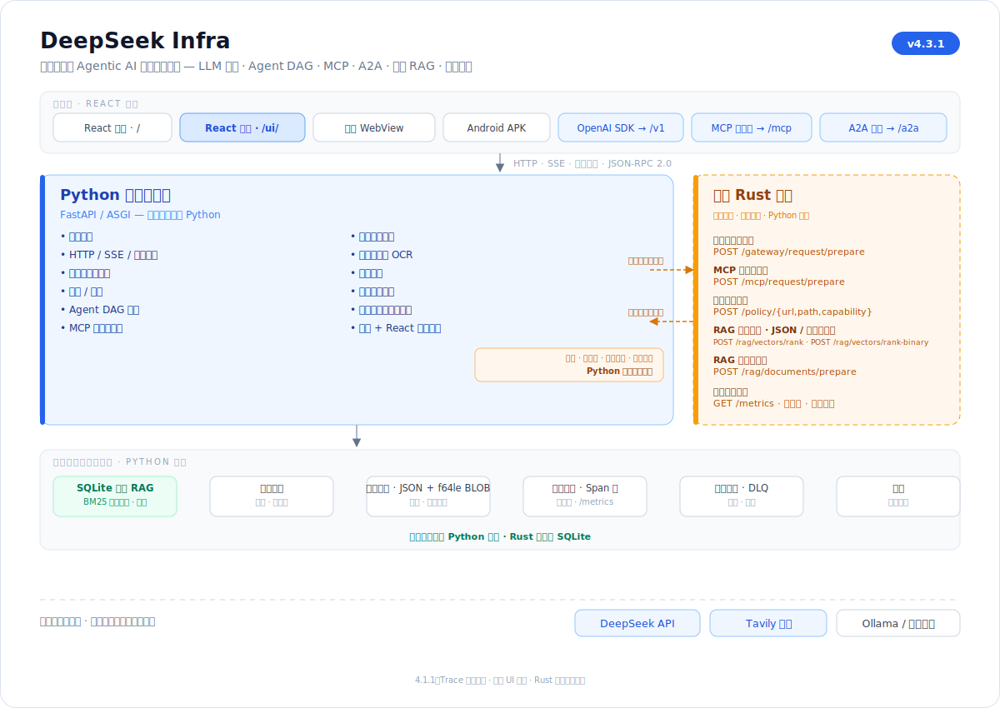
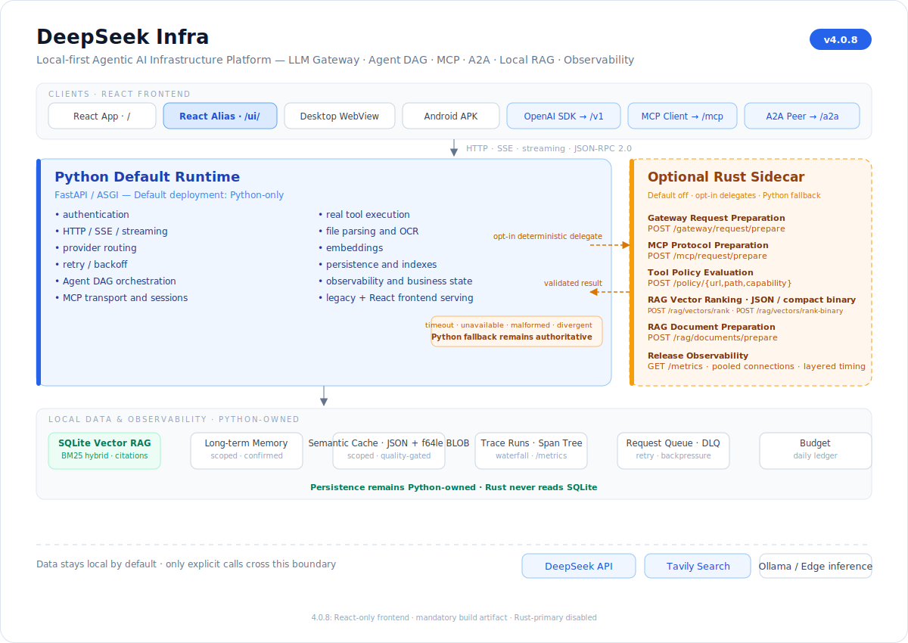

# DeepSeek Infra

<!-- docs-language-switcher:start -->
[中文](README.md) / [English](README.en.md)
<!-- docs-language-switcher:end -->


DeepSeek Infra is a local-first Agentic AI infrastructure platform that combines an LLM gateway, persistent Agent DAG runtime, MCP-native tool hub, A2A-style agent mesh, local RAG, automation, workspace data, and end-to-end observability in one private runtime.

## 4.1.0 at a glance

- Workspace Providers are scoped to chat routes and are not initialized by direct Trace navigation.
- `/trace/:traceId` and the shared Diagnostics Trace view load on demand with feature-owned CSS.
- Trace HTTP requests accept `AbortSignal` and are aborted on navigation or unmount.
- Route-level error boundaries provide reload and return-to-chat recovery.
- Vite-manifest and Chromium gates verify deferred chunks, provider isolation, navigation, refresh, and offline behavior.
- Python remains the default and authoritative runtime.
- Every Rust delegate is opt-in and protected by Python fallback.
- DeepSeek and Tavily credentials stay in memory in the React application.

See the [4.1.0 release notes](docs/releases/4.1.0.md), [frontend boundaries](docs/FRONTEND_MODULES.md), [upgrade guidance](docs/UPGRADING_TO_4_0.md), and [support policy](docs/4_0_SUPPORT_POLICY.md).

## Architecture

<details>
<summary><strong>中文架构图</strong></summary>



</details>

<details open>
<summary><strong>English architecture</strong></summary>



</details>

## Quick start

```bash
python -m pip install -r requirements.txt
cp .env.example .env
python launch.py --server
```

Open `http://127.0.0.1:8000/` for the stable workspace or `http://127.0.0.1:8000/ui/` for the React chat slice.

Docker:

```bash
cp .env.example .env
docker compose up -d
curl http://127.0.0.1:8000/healthz
```

## Documentation

The language switcher at the top of every human-maintained Markdown document returns to either the Chinese or English documentation entry. Deep technical documents remain canonical even when a complete line-by-line translation is not yet available.

- [Standalone roadmap](ROADMAP.en.md)
- [Architecture](docs/ARCHITECTURE.md)
- [Getting started](docs/GETTING_STARTED.md)
- [API reference](docs/API.md)
- [Deployment](docs/DEPLOYMENT.md)
- [Security](docs/SECURITY.md)
- [Threat model](docs/THREAT_MODEL.md)
- [Implementation status](docs/IMPLEMENTATION_STATUS.md)
- [Evidence index](docs/EVIDENCE_INDEX.md)
- [Release checklist](docs/RELEASE_CHECKLIST.md)
- [Changelog](CHANGELOG.md)

## Validation

```bash
npm ci --prefix frontend
npm run check --prefix frontend
ruff check .
mypy .
pytest --cov --cov-fail-under=95
python scripts/preflight_release.py --version 4.1.0 --ga
```

Except for requests explicitly sent to configured providers such as DeepSeek or Tavily, project data remains local by default.
