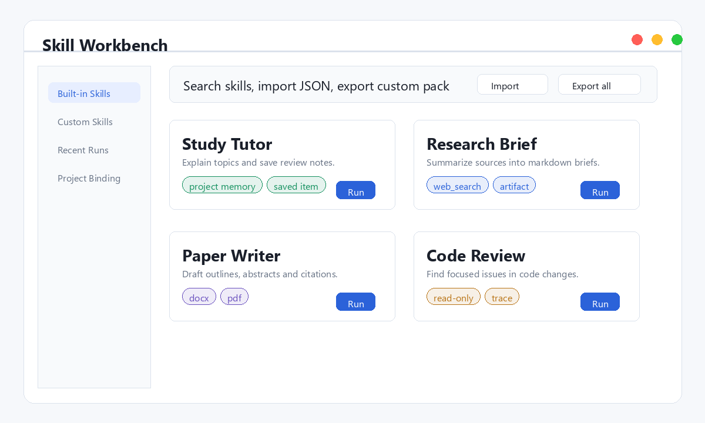
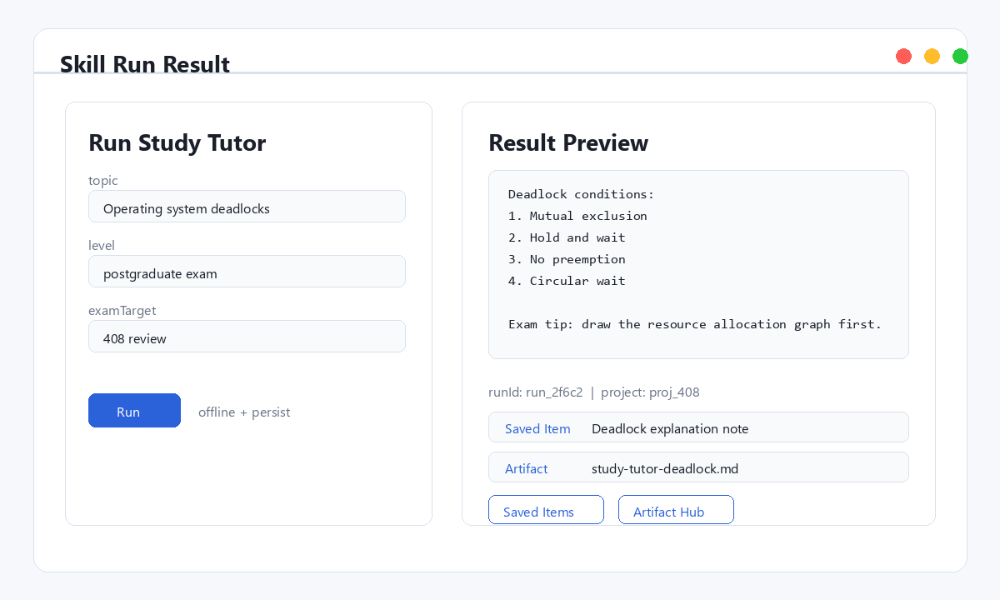
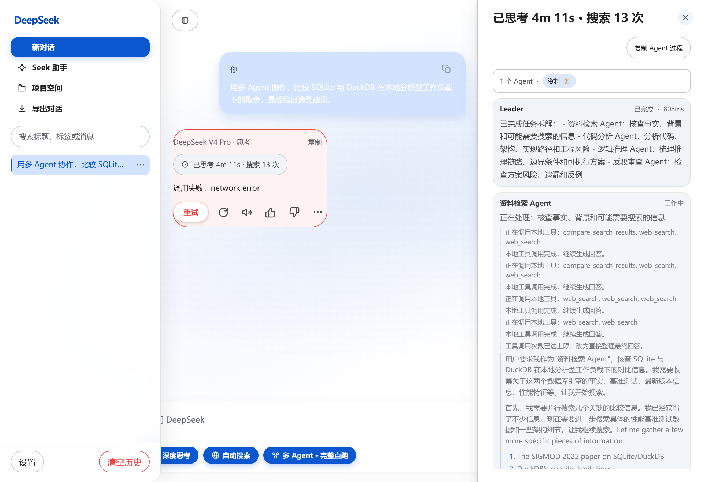
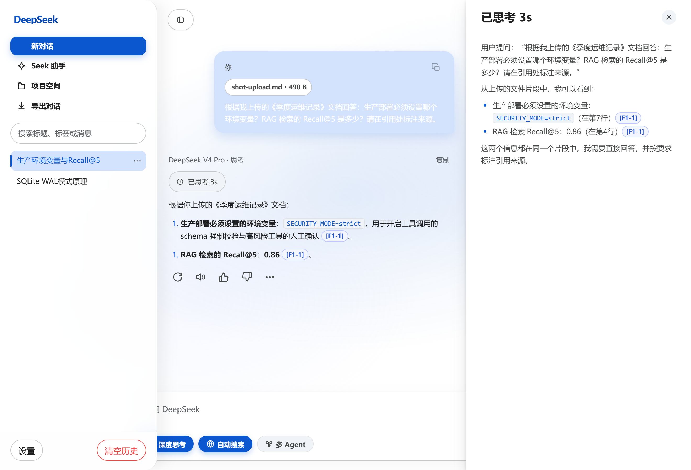

# Demo 3.0

Applicable version: v3.0.1.

This demo shows the Personal AI Runtime as one local workspace rather than separate features.

## Run

```bash
python scripts/smoke_ga.py --offline --out docs/evidence/ga-v3.0.1.json --json
```

The smoke creates an isolated runtime root and exercises the complete chain:

1. Create a project.
2. Add project-scoped memory.
3. Run an offline skill.
4. Register a media item that represents a browser snapshot.
5. Save a source-linked item.
6. Register a source-linked artifact.
7. Run an automation that writes project outputs and a summary memory.
8. Export the project ZIP.
9. Build Workspace Home and the Provenance Graph.

## Screenshots









## Evidence

Primary evidence: `docs/evidence/ga-v3.0.1.json`.

Release gate:

```bash
python scripts/preflight_release.py --version 3.0.1 --ga
```
