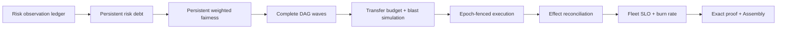

# Runbook: Durable Fleet SLO & Evidence-Closed Autonomous Operations (DeepSeek Infra 4.7.4)

<!-- docs-language-switcher:start -->
[中文](../../README.md) / [English](../../README.en.md)
<!-- docs-language-switcher:end -->


## 1. Overview & Architecture

DeepSeek Infra 4.7.4 makes coordinated remediation durable across control loops
and independently auditable. Exact RiskSubject observations, scheduler service
history, Fleet SLO samples, execution waves, claims, effects, and proof bindings
are persisted. Real Repair/Rebalance effects remain constrained to reversible
operations; primary promotion, deletion, replication weakening, and policy
mutation are never autonomous.

The runtime control loop is:



The execution core remains:

```
+-----------------------------------------------------------------------------------+
|                        Multi-Risk Assessment Engine                                |
|    - Assesses replica lag, capacity exhaustion, DR drill staleness, authority     |
|    - Emits RiskSnapshot v1 with deterministic SHA-256 riskDigest                  |
+-----------------------------------------+-----------------------------------------+
                                          |
                                          v
+-----------------------------------------------------------------------------------+
|                      Resilience Coordinator (Gate H & I)                          |
|    - Emits typed ResilienceCoordinationPlan v1 with deterministic planDigest       |
|    - Builds multi-risk DAG: [CREATE_REPAIR_JOB] -> [CREATE_REBALANCE_JOB]         |
|    - Invariant: never touches minCommittedCopies or minFailureDomains              |
|    - Authority Circuit Breaker: blocks mutations if authority degraded            |
+-----------------------------------------+-----------------------------------------+
                                          |
                                          v
+-----------------------------------------------------------------------------------+
|               Immutable Action Journal & CAS Fencing (Gate A & B)                 |
|    - Create-once Plan & Action Identity (409 on mutation conflict, idempotent)    |
|    - CAS Claim: increments executionEpoch, generates claimToken, sets leaseUntil  |
|    - Transactional Resource Locks: (backup:pid:bid, target:tid, policy:pid)       |
+-----------------------------------------+-----------------------------------------+
                                          |
                                          v
+-----------------------------------------------------------------------------------+
|                   Crash-Recoverable Execution & Effect Reconciliation             |
|    - Persists effectHandle (repairId, jobId, resilienceActionId)                  |
|    - Worker crash recovery reconciles in-flight jobs (Gate C)                     |
|    - Stale workers with expired epochs are fenced out with 409                    |
+-----------------------------------------+-----------------------------------------+
                                          |
                                          v
+-----------------------------------------------------------------------------------+
|              Real Outcome & Scoped Risk Verification (Gate E & F)                 |
|    - Repair: verified to complete, authenticated with Receipt v4 + Commit v4      |
|    - Rebalance: executed to complete, destination copy committed & authenticated  |
|    - Scoped Risk Reduction: compares severityBefore vs severityAfter on subject   |
|    - Emits cryptographic Decision Proof v3                                        |
+-----------------------------------------+-----------------------------------------+
```

---

## 2. Core Gates & Guarantees

| Gate | Description | Enforcement Point |
| :--- | :--- | :--- |
| **Gate A** | **Immutable Identity** | `resilience_action_journal.py`: Create-once plan/action. Idempotent on identical digest, 409 conflict on mutation, never resets `SUCCEEDED` to `PENDING`. |
| **Gate B** | **CAS Fencing & Atomic Admission** | `admit_and_claim_action()`: one `BEGIN IMMEDIATE` boundary checks budgets, acquires resource locks, increments `executionEpoch`, and issues `claimToken`. |
| **Gate C** | **Live Effect Reconciliation** | `resilience_effect_reconciler.py`: takeover enters `RECONCILING` and finds the durable Repair/Rebalance effect before any new mutation. Unknown remote state fails closed. |
| **Gate D** | **All-Subsystem Idempotency**| `backup_dr_readiness.py`: `run_dr_drill` accepts `resilience_action_id` and deduplicates against existing records. |
| **Gate E** | **Real Outcome Contracts** | `resilience_outcome_verifier.py`: Verifies full destination durability, Receipt v4/Commit v4 authentication, and failure domain objectives. |
| **Gate F** | **Scoped Risk Reduction** | `verify_scoped_risk_reduction()`: Matches exact `riskSubject` and derives `effectObserved = (severityAfter < severityBefore)`. |
| **Gate H/I**| **Complete DAG Waves & Transfer Budget** | `resilience_fleet_scheduler.py`: every candidate is assigned to a wave or typed `UNSCHEDULABLE`; `backup_transfer_budget` prevents Rebalance from consuming Repair reserve. |
| **Gate J** | **Safe-Point Preemption** | Only `PENDING` or `CLAIMED + NO_EFFECT` victims are eligible. Victim transition, resource release, decision record, and critical Repair claim share one transaction. |
| **Gate K** | **Monotonic Blast-Radius Safety** | `simulate_coordination_wave()` includes running effects. Healthy fleets retain policy minima; already-degraded fleets retain their current copy/domain baseline. |
| **Gate L** | **Typed Compensation** | Safe transitions: `NO_EFFECT -> FAILED_BEFORE_EFFECT`, `CANCELABLE -> COMPENSATED`, `EFFECT_UNKNOWN -> EFFECT_UNKNOWN`, `IRREVERSIBLE -> NEEDS_OPERATOR`. |
| **Gate M** | **Durable Fleet SLO & Maintenance** | `.resilience-slo/slo.sqlite3` stores latency/freshness/starvation samples and 1h/24h burn observations. Critical durability Repair and critical DR staleness may override maintenance windows. |
| **Gate N** | **Evidence Closure & Readiness** | Exact Receipt/Commit bytes and provider metadata are semantically validated; report/proof/hash travel together; authenticated readiness is assembled from durable sources. |

### 2.1 Durable state ownership

| State | Durable location | Recovery meaning |
| :--- | :--- | :--- |
| Risk lifecycle | `.resilience-risk/risk.sqlite3` | `firstSeenAt`, current open interval, clear/reopen count, exact subject digest |
| Scheduler service | `.resilience-scheduler/service.sqlite3` | per-policy virtual runtime/finish, actions/bytes served, schedule snapshots |
| Action/effect journal | `.resilience-journal/journal.sqlite3` | epoch/token claims, lease, state, immutable events, preemption decisions |
| Fleet SLO | `.resilience-slo/slo.sqlite3` | samples, burn observations, evidence verification freshness |

These databases are control-plane state. They do not alter Receipt v4, Commit
v4, `object-set-v1`, FastCDC v3, randomized Age, Projection, or Authority wire
formats.

---

## 3. Operator Procedures & Troubleshooting

### 3.1 Inspecting Fleet readiness

The endpoint is read-only and requires the normal bearer token:

```powershell
$headers = @{
  Authorization = "Bearer $env:DEEPSEEK_AUTH_TOKEN"
  'X-DeepSeek-Client' = 'operator'
}
Invoke-RestMethod -Headers $headers -Uri 'http://127.0.0.1:8000/api/workspace/resilience/readiness'
```

Interpretation:

- `READY`: no open risk, no typed unschedulable action, DR SLO is compliant,
  burn is below critical thresholds, and a verified proof sample exists.
- `DEGRADED`: open non-critical risk, unschedulable work, stale DR readiness, or
  missing proof freshness.
- `CRITICAL`: critical/blocked risk or both configured burn windows cross their
  critical thresholds.

### 3.2 Inspecting Active Coordination & Leases

Query the journal API to inspect running actions and active leases:
```bash
# List all active actions
curl -s -H "Authorization: Bearer $TOKEN" \
  http://127.0.0.1:8000/api/workspace/resilience/journal?limit=50

# Inspect latest coordination plan DAG
curl -s -X POST -H "Authorization: Bearer $TOKEN" \
  http://127.0.0.1:8000/api/workspace/resilience/coordination-plan
```

### 3.3 Handling `NEEDS_OPERATOR` or `EFFECT_UNKNOWN` Actions

1. Identify the action:
   ```bash
   sqlite3 .resilience-journal/journal.sqlite3 "SELECT action_id, action_type, state, compensation_state, error_message FROM resilience_actions WHERE state IN ('NEEDS_OPERATOR', 'EFFECT_UNKNOWN');"
   ```
2. Check underlying subsystem job state:
   - For repairs: check `.backup-replication/repairs/<repair_id>.json`
   - For rebalances: check `.backup-rebalance/rebalances/<job_id>.json`
   - For DR drills: check `.restore-staging/<drill_id>/drill-result.json`
3. If remote mutation was executed cleanly:
   - Authenticate destination copy with `backup_replication.authenticate_committed_copy()`.
   - Update action state to `SUCCEEDED` or resolve manually.
4. If remote mutation failed:
   - Cancel job and clear locks using `resilience_action_journal.compensate_action(action_id, "Operator resolved", effect_class="CANCELABLE")`.

### 3.4 Emergency Circuit Breaker

If an authority degradation or target partition occurs:
1. The coordinator automatically marks all mutations with `requiresApproval = True` and sets `status = "BLOCKED"`.
2. To pause all autonomous actions globally, update the automation policy:
   ```json
   {
     "policyVersion": 1,
     "autonomousExecutionEnabled": false
   }
   ```
   persisted in `.resilience-policy/autonomous_policy.json`.

### 3.5 Forensic proof verification

Formal artifacts must contain both paths:

```text
docs/evidence/storage-control-plane-minio-v4.7.4.json
docs/evidence/storage-control-plane-autonomous-proof-v4.7.4.json
```

Verify that the report names the exact proof bytes before inspecting claims:

```powershell
$version = (Get-Content -LiteralPath VERSION -Raw).Trim()
$reportPath = "docs/evidence/storage-control-plane-minio-v$version.json"
$report = Get-Content -LiteralPath $reportPath -Raw | ConvertFrom-Json
$proofPath = [string]$report.proofArtifact.path
$actualSha = (Get-FileHash -LiteralPath $proofPath -Algorithm SHA256).Hash.ToLowerInvariant()
if ($actualSha -ne [string]$report.proofArtifact.sha256) { throw 'autonomous proof SHA-256 mismatch' }
if ((Get-Item -LiteralPath $proofPath).Length -ne [long]$report.proofArtifact.bytes) { throw 'autonomous proof size mismatch' }
python scripts/validate_evidence_proof.py --proof $proofPath --scenario real-three-minio-autonomous-remediation
```

Do not accept a report-only PASS, a proof copied from a different revision, or
locally generated proof as exact-merge Evidence. Evidence Assembly repeats the
path/SHA/size/scenario and semantic checks and rejects a missing proof.

### 3.6 Maintenance-window behavior

- Critical durability Repair may run outside the configured window and records
  `CRITICAL_DURABILITY_OVERRIDE`.
- Warning Rebalance remains typed `OUTSIDE_MAINTENANCE_WINDOW` until a valid
  window.
- DR Drill normally waits; critical DR staleness may record
  `CRITICAL_DR_STALENESS_OVERRIDE`.
- An invalid timezone/window is not silently treated as permission to mutate.

---

## 4. Verification Checkpoints

- **Immutable Journal**: `tests/test_backup_472_crash_recovery_leases.py`
- **Coordination Graph & Safety Budgets**: `tests/test_backup_472_resilience_coordination.py`
- **Outcome Contracts & Scoped Reduction**: `tests/test_backup_472_outcome_verification.py`
- **Three-MinIO Remediation**: `tests/test_backup_472_real_three_minio_remediation_e2e.py`
- **Persistent Risk/Fairness**: `tests/test_backup_474_risk_fairness.py`
- **Waves/Budget/Preemption/Blast**: `tests/test_backup_474_scheduler_correctness.py`
- **Fleet SLO/Maintenance/Readiness**: `tests/test_backup_474_slo_readiness.py`
- **Proof/Assembly Closure**: `tests/test_backup_474_evidence_closure.py`, `tests/test_evidence_assembly.py`
